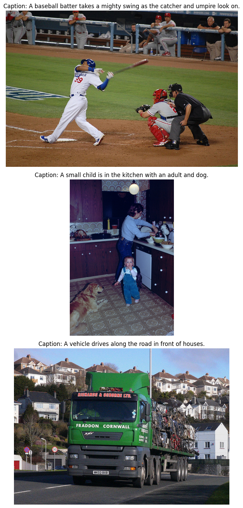

# Vision Transformer Image Classification Cats vs Dogs

## 1. Nama dan Deskripsi Task

**Task:** Image Classification

**Deskripsi:**  
Mengklasifikasikan gambar sesuai dengan hewan yang berada pada gambar tersebut. Label 0 sebagai kucing, label 1 sebagai anjing.

## 2. Nama Dataset, Link, Statistik, dan Contoh

**Nama Dataset:** Cats vs Dogs  
**Sumber:** [HuggingFace Datasets - cats_vs_dogs](https://huggingface.co/datasets/cats_vs_dogs)

**Statistik Dataset:**
- Total gambar: 23.262
- Jumlah kelas: 2 (kucing = 0, anjing = 1)
- Proporsi data:  
  - Train: ~90%  
  - Test: ~10%  
- Semua gambar yang digunakan memiliki 3 channel (RGB).

**Contoh Isi Dataset:**




**Contoh kode akses data:**
```python
from datasets import load_dataset
dataset = load_dataset("cats_vs_dogs")
sample = dataset['train'][0]
print(sample['image'])  # PIL Image
print(sample['labels']) # 0 (kucing) atau 1 (anjing)
```

**Distribusi kelas (setelah filter RGB):**
- Kucing: sekitar 11.682 gambar
- Anjing: sekitar 11.580 gambar

---
**Catatan:**  
Dataset diunduh otomatis dari HuggingFace Datasets. Seluruh preprocessing dan pembagian train/test dilakukan di notebook.
